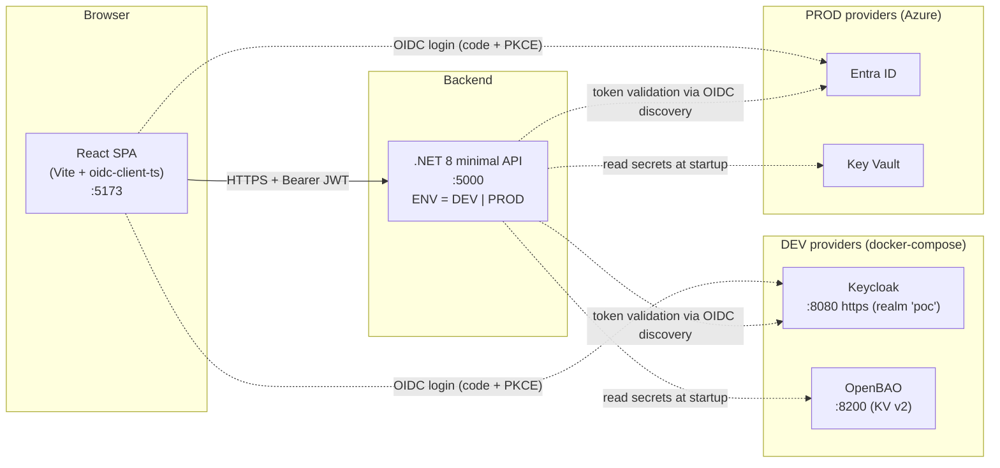
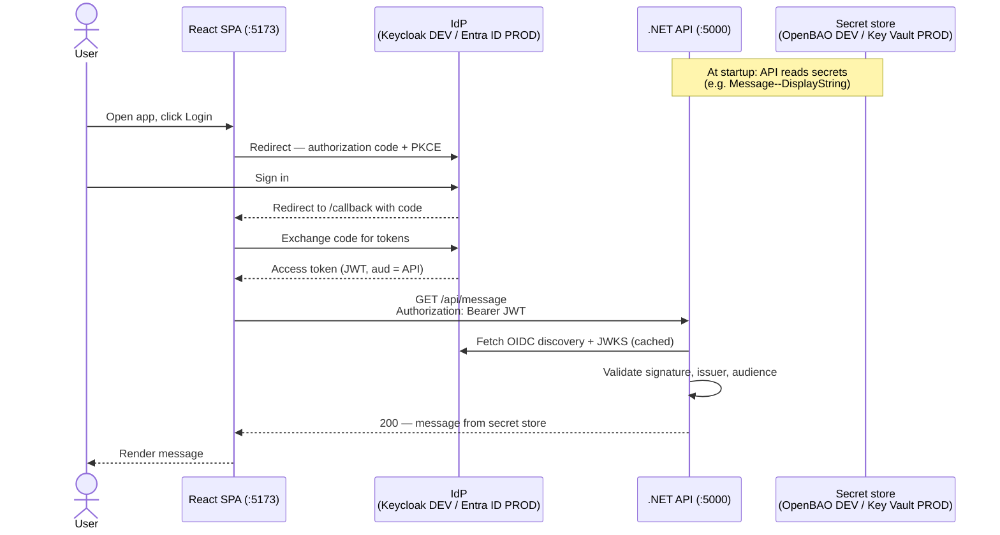
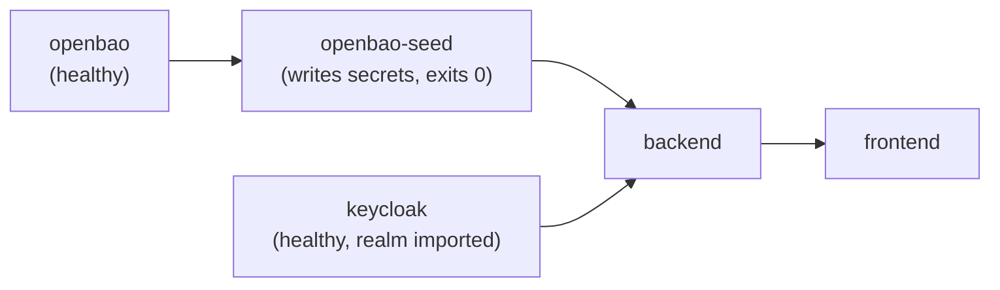

# POC.Authentication

Proof-of-concept for a **dual-identity-provider** web app: one React SPA + one .NET API that
authenticate against **Keycloak in DEV** and **Azure Entra ID in PROD**, and read secrets from
**OpenBAO in DEV** and **Azure Key Vault in PROD** — switched by a single `ENV` variable
(`DEV` | `PROD`). Feature code never branches on the provider; only configuration changes.

| Concern | DEV | PROD |
|---|---|---|
| Identity (OIDC) | Keycloak (local container) | Azure Entra ID |
| Secrets | OpenBAO (local container) | Azure Key Vault |
| Switch | `ENV=DEV` | `ENV=PROD` |

## Architecture



The same SPA and API images run in both modes. The mode picks which IdP/secret store the
configuration points at:

- **Frontend** — one generic `oidc-client-ts` `UserManager` ([frontend/src/auth/userManager.ts](frontend/src/auth/userManager.ts)). No MSAL, no per-IdP adapter: only the baked-in `VITE_*` values (authority, client id, scope) differ per build.
- **Backend** — `Program.cs` reads `ENV`, loads `appsettings.{ENV}.json`, then layers env vars and the ENV-selected secret store ([backend/src/Api/Program.cs](backend/src/Api/Program.cs)). JWT validation uses OIDC discovery — issuer and signing keys are never hardcoded.

## Authentication flow



## Repository layout

| Path | What |
|---|---|
| `frontend/` | React SPA (Vite + ShadCN + Tailwind, oidc-client-ts) |
| `backend/` | .NET 8 minimal API (JWT bearer, options-pattern config) |
| `infra/dev/` | DEV compose stack: frontend + backend + Keycloak + OpenBAO |
| `infra/prod/` | PROD-from-local compose stack: frontend + backend vs real Azure |
| `docs/` | Project documentation |

## Prerequisites

- Docker with **Compose v2** (tested on v2.40). The DEV stack is started in dependency order by the root `dev-up.ps1` (OpenBAO → Keycloak → app)
- PROD mode only: an Azure tenant with the app registrations + Key Vault described below

Both stacks publish the same host ports — run **one at a time**.

## Run in DEV mode

Everything is local; no cloud account needed.

```powershell
# 1. Create the DEV env file (working DEV defaults) — once, at the POC root
Copy-Item ..\.env.example ..\.env.dev

# 2. Start the whole stack in order (OpenBAO -> Keycloak -> backend/frontend) via the root script:
..\dev-up.ps1                  # add -WithDab to also launch POC.DAB
# (this repo's infra/dev compose is APP-ONLY now — running it alone won't start Keycloak/OpenBAO)
```

Boot order is enforced by `dev-up.ps1` (it waits for each stage):



Then open <http://localhost:5173> and log in with the DEV test user:

| User | Password | Scope |
|---|---|---|
| `testuser` | `Test1234!` | DEV-only — lives in the throwaway local realm, never reuse anywhere real |

| Service | URL |
|---|---|
| Frontend (nginx) | <http://localhost:5173> |
| Backend | <http://localhost:5000> — `/` liveness, `/api/message` gated |
| Keycloak admin | <https://localhost:8080> — `admin` / `admin`, realm `poc` (shared w/ POC.DAB) |
| OpenBAO | <http://localhost:8200> — dev mode, KV v2 at `secret/` |

## Run in PROD mode

Containers run locally but authenticate against **real** Entra ID and Key Vault.

### One-time Azure setup (per tenant)

1. **SPA app registration** — SPA platform redirect `http://localhost:5173/callback`; delegated permission to the API scope (consented). The backend resolves Key Vault via `DefaultAzureCredential` (managed identity / env), so it needs **Key Vault Secrets User** role on the vault — no client secret.
2. **API app registration** — Application ID URI `api://<api-client-id>`, scope `access_as_user`, `requestedAccessTokenVersion: 2`.
3. **Key Vault** — secret `Message--DisplayString` (the string the SPA renders).

### Build and run

```sh
# 1. Put your tenant/app/vault ids + the live client secret in ../.env.prod (gitignored).
#    Seed it from the PROD section of ../.env.example.

# 2. Build and start (no local IdP/secret containers — backend talks to Azure directly).
docker compose -f infra/prod/docker-compose.yml \
  --env-file ../.env.prod up --build
```

Open <http://localhost:5173> and sign in with a real Entra ID account.

> **Note:** Entra v2 access tokens carry the **bare client-id GUID** in `aud` (not
> `api://<guid>`) — `AUTH_API_AUDIENCE` in `.env.prod` is set accordingly.

## Images

Both apps build as multi-stage Docker images; the compose stacks build them automatically.

| App | Build stage | Runtime stage |
|---|---|---|
| frontend | `node:22-alpine` — `npm ci && npm run build` (Vite bakes `VITE_*` at build time → build-per-env) | `nginx:alpine` serving `dist/` with SPA fallback |
| backend | `dotnet/sdk:8.0` — publish | `dotnet/aspnet:8.0`, non-root |

## Troubleshooting

The classic failure is **401 with a valid login** — almost always an issuer or audience
mismatch between the token and what the backend validates. The DEV stack pre-mitigates the
known traps (Keycloak issuer host, audience mapper, health checks); the why behind each
setting is documented in [infra/README.md](infra/README.md).
