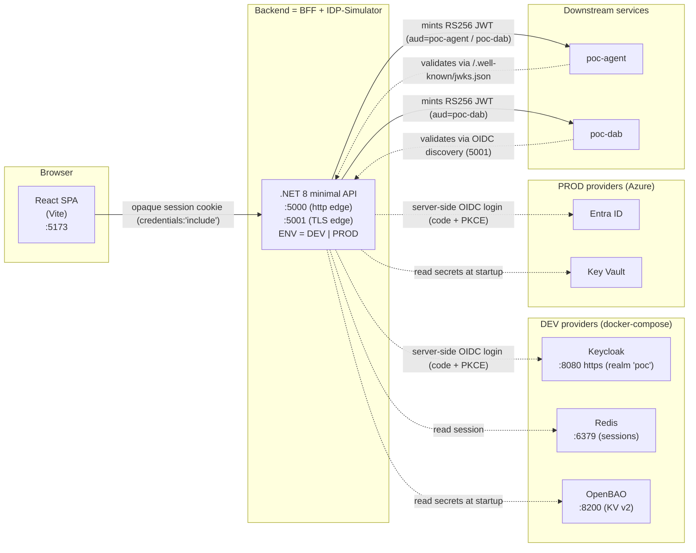

# POC.BFF

Proof-of-concept for a **BFF (Backend-for-Frontend) + IDP-Simulator** web app: one React SPA + one
.NET API where the **backend owns login server-side** (an OIDC authorization-code + PKCE flow against
**Keycloak in DEV** and **Azure Entra ID in PROD**) and then **mints its own short-lived JWTs** for
downstream services. The same backend reads secrets from **OpenBAO in DEV** and **Azure Key Vault in
PROD** — switched by a single `ENV` variable (`DEV` | `PROD`). Feature code never branches on the
provider; only configuration changes.

The browser never sees a token: it holds **only an opaque, httpOnly + Secure + SameSite=Lax session
cookie**. The id_token is validated once at the callback and discarded; sessions live in **Redis**.

| Concern | DEV | PROD |
|---|---|---|
| External IDP (OIDC login) | Keycloak (local container) | Azure Entra ID |
| Session store | Redis (local container) | Redis |
| Secrets | OpenBAO (local container) | Azure Key Vault |
| Switch | `ENV=DEV` | `ENV=PROD` |

## Architecture



The same SPA and API images run in both modes. The mode picks which external IDP / secret store the
configuration points at:

- **Frontend** — no `oidc-client-ts`, no MSAL, no token handling. `AuthContext` is driven by the BFF's `/auth/me` (with `credentials:'include'`); `login()` simply redirects the whole browser to the BFF `/auth/login` ([frontend/src/auth/AuthContext.tsx](frontend/src/auth/AuthContext.tsx)). The only baked-in build var is `VITE_API_BASE_URL`.
- **Backend (BFF + IDP-Simulator)** — `Program.cs` reads `ENV`, loads `appsettings.{ENV}.json`, then layers env vars and the ENV-selected secret store ([backend/src/Api/Program.cs](backend/src/Api/Program.cs)). The BFF runs the server-side OIDC code flow (issuer + signing keys resolved via OIDC discovery, never hardcoded), then mints short-lived RS256 JWTs per downstream audience and publishes its own public key at `/.well-known/jwks.json`.

## Authentication flow

The login (authorization-code + PKCE) runs **entirely server-side in the BFF**. The browser only ever
follows redirects and ends up holding the opaque session cookie — it never sees `code`, `state`,
`code_verifier`, or the id_token. The BFF's own external-IDP client is **`poc-bff`** (public PKCE;
`Auth.ClientId` in appsettings).

```mermaid
sequenceDiagram
    actor User
    participant SPA as React SPA (:5173)
    participant BFF as BFF / IDP-Simulator (:5000 / :5001 TLS)
    participant IdP as External IDP<br/>(Keycloak DEV / Entra ID PROD)
    participant Redis as Redis (sessions)
    participant Store as Secret store<br/>(OpenBAO DEV / Key Vault PROD)

    Note over BFF,Store: At startup: BFF reads secrets<br/>(RSA signing key, Message--DisplayString)

    User->>SPA: Open app, click Login
    SPA->>BFF: GET /auth/login (full-page redirect)
    BFF->>BFF: Mint state + code_verifier + nonce<br/>set short-TTL correlation cookie
    BFF-->>User: 302 to IDP authorize URL
    User->>IdP: Sign in (code + PKCE)
    IdP-->>BFF: 302 to /auth/callback with code
    BFF->>IdP: Exchange code (+ code_verifier) for id_token
    BFF->>BFF: Validate id_token ONCE; resolve roles[]+region<br/>from config RoleMap (keyed on preferred_username)
    BFF->>Redis: Create session (session:{id})
    BFF-->>User: Set opaque session cookie, 302 to SPA

    User->>SPA: Back on SPA
    SPA->>BFF: GET /auth/me (credentials:'include')
    BFF-->>SPA: 200 — { displayName, roles } (no token, no region)

    SPA->>BFF: POST /api/ask (cookie/session auth, RBAC reader/manager)
    BFF->>BFF: Mint short-lived RS256 JWTs<br/>(aud=poc-agent, aud=poc-dab) from session claims
    BFF->>BFF: Call downstream Agent with minted tokens
    BFF-->>SPA: 200 — answer
    SPA-->>User: Render answer
```

### BFF as IDP-Simulator

After login the BFF stops forwarding any external token. For every downstream call it **mints its own
short-lived (300s) RS256 JWTs**, one per audience (`poc-agent`, `poc-dab`), signed by an RSA-2048 key
from the secret store. The downstream services validate those tokens against the BFF's published keys:

- `GET /.well-known/jwks.json` — the public JWKS (consumed by the Agent and DAB).
- `GET /.well-known/openid-configuration` — a minimal OIDC discovery document so DAB can resolve the
  JWKS from its configured issuer.

Claims are **flat `roles[]` + `region`**, resolved from a **config-driven `RoleMap` keyed on
`preferred_username`** ([backend/src/Api/appsettings.DEV.json](backend/src/Api/appsettings.DEV.json)) —
the external IDP's own role claims are **not** authoritative.

### Live endpoints

| Endpoint | Auth | Notes |
|---|---|---|
| `/auth/login`, `/auth/callback` | none (login flow) | server-side OIDC code + PKCE; callback creates the session |
| `/auth/me`, `/auth/logout`, `/auth/extend-session` | session cookie | `me` returns `{ displayName, roles }`; `extend-session` is the full-TTL refresh |
| `/api/message` | session cookie | renders the secret-store message |
| `/api/ask` | session cookie + RBAC (reader/manager) | mints both downstream tokens, calls the Agent |
| `/api/ask/stream` | session cookie + RBAC (reader/manager) | net-new SSE (`text/event-stream`, `message` + `control` events) with a proactive extend watcher that re-mints the downstream token mid-stream |

Inbound JwtBearer validation was removed — there is no `Authorization: Bearer` path for the browser.
The SPA reads the stream via [frontend/src/api/stream.ts](frontend/src/api/stream.ts).

## Repository layout

| Path | What |
|---|---|
| `frontend/` | React SPA (Vite + ShadCN + Tailwind; cookie/session auth, no token in JS) |
| `backend/` | .NET 8 minimal API — BFF + IDP-Simulator (server-side OIDC, RS256 minting, Redis sessions, options-pattern config) |
| `infra/dev/` | DEV compose stack: frontend + backend + Redis + TLS terminator (Keycloak + OpenBAO come from the root stack) |
| `infra/prod/` | PROD-from-local compose stack: frontend + backend vs real Azure |
| `docs/` | Project documentation |

## Prerequisites

- Docker with **Compose v2** (tested on v2.40). The DEV stack is started in dependency order by the root `dev-up.ps1` (OpenBAO → Keycloak → app)
- PROD mode only: an Azure tenant with the app registrations + Key Vault described below

Both stacks publish the same host ports — run **one at a time**.

## Run in DEV mode

Everything is local; no cloud account needed.

```powershell
# 1. Create the DEV env file (working DEV defaults) — once, at the POC root
Copy-Item ..\.env.example ..\.env.dev

# 2. Start the whole stack in order (OpenBAO -> Keycloak -> backend/frontend) via the root script:
..\dev-up.ps1                  # add -WithDab to also launch POC.DAB
# (this repo's infra/dev compose is APP-ONLY now — running it alone won't start Keycloak/OpenBAO)
```

Boot order is enforced by `dev-up.ps1` (it waits for each stage):

```mermaid
flowchart LR
    BAO["openbao<br/>(healthy)"] --> SEED["openbao-seed<br/>(writes secrets, exits 0)"]
    SEED --> BE["backend"]
    KC["keycloak<br/>(healthy, realm imported)"] --> BE
    REDIS["redis<br/>(sessions)"] --> BE
    BE --> TLS["tls-terminator<br/>(:5001)"]
    BE --> FE["frontend"]
```



The DEV secret seed (`seed.sh`) writes the BFF's RSA signing key as `IdpSimulator--SigningKeyPem`
alongside `Message--DisplayString`. In PROD both come from Key Vault.

Then open <http://localhost:5173> and log in with the DEV test user:

| User | Password | Scope |
|---|---|---|
| `testuser` | `Test1234!` | DEV-only — lives in the throwaway local realm, never reuse anywhere real |

| Service | URL |
|---|---|
| Frontend (nginx) | <http://localhost:5173> |
| Backend (http edge) | <http://localhost:5000> — `/` liveness, `/auth/*` + `/api/*` (cookie/session). Browser fetches use this http edge so the SameSite=Lax cookie attaches |
| Backend (TLS edge) | <https://localhost:5001> — nginx TLS terminator for DAB OIDC discovery / JWKS + the OIDC `/auth/callback` |
| Redis | `localhost:6379` — DEV session store, auth-less, no persistence |
| Keycloak admin | <https://localhost:8080> — `admin` / `admin`, realm `poc` (shared w/ POC.DAB) |
| OpenBAO | <http://localhost:8200> — dev mode, KV v2 at `secret/` |

## Run in PROD mode

Containers run locally but authenticate against **real** Entra ID and Key Vault.

### One-time Azure setup (per tenant)

In the BFF model the **browser never talks to Entra directly** — the BFF is the OIDC client and runs
the code + PKCE exchange server-side. So there is a single app registration, and its redirect URI
points at the BFF callback, not the SPA.

1. **BFF (web) app registration** — the OIDC client the backend uses. Web-platform redirect URI
   `https://<backend-tls-host>/auth/callback` (the TLS edge — in DEV this is
   `https://localhost:5001/auth/callback`). The BFF performs the code exchange; configure it for
   authorization-code + PKCE.
2. **Key Vault** — secrets `Message--DisplayString` (the rendered message) and the BFF's RSA signing
   key (`IdpSimulator--SigningKeyPem`). The backend resolves Key Vault via `DefaultAzureCredential`
   (managed identity / env), so it needs the **Key Vault Secrets User** role on the vault.

The downstream services (`poc-agent`, `poc-dab`) trust the **BFF's own minted RS256 tokens** via its
`/.well-known/jwks.json` — they do not validate Entra tokens, so no separate API app registration /
exposed scope is required.

### Build and run

```sh
# 1. Put your tenant/BFF-app/vault ids in ../.env.prod (gitignored).
#    Seed it from the PROD section of ../.env.example.

# 2. Build and start (no local IdP/secret/Redis-image swap — backend talks to Azure + Redis directly).
docker compose -f infra/prod/docker-compose.yml \
  --env-file ../.env.prod up --build
```

Open <http://localhost:5173> and sign in with a real Entra ID account.

## Images

Both apps build as multi-stage Docker images; the compose stacks build them automatically.

| App | Build stage | Runtime stage |
|---|---|---|
| frontend | `node:22-alpine` — `npm ci && npm run build` (Vite bakes the single `VITE_API_BASE_URL` at build time → build-per-env) | `nginx:alpine` serving `dist/` with SPA fallback |
| backend | `dotnet/sdk:8.0` — publish | `dotnet/aspnet:8.0`, non-root |

## Troubleshooting

Two classic failures:

- **401 on `/auth/me` right after a "successful" login** — the session cookie did not attach. It is
  httpOnly + Secure + SameSite=Lax, so the SPA must call the BFF over the **same scheme as its own
  origin** (the http://localhost:5000 edge in DEV) with `credentials:'include'`, and the OIDC callback
  must come back through the TLS edge that matches `Auth.RedirectUri`.
- **Downstream 401 from the Agent or DAB** — an issuer/audience mismatch between the BFF's minted
  RS256 token and what the downstream validates. The downstreams fetch the BFF's
  `/.well-known/jwks.json` (DAB via `/.well-known/openid-configuration` on the TLS edge); the minted
  `iss`/`aud` must match their configured issuer and `poc-agent` / `poc-dab` audiences.

The DEV stack pre-mitigates the known traps (Keycloak issuer host, the TLS edge for DAB discovery,
health checks); the why behind each setting is documented in [infra/README.md](infra/README.md).
